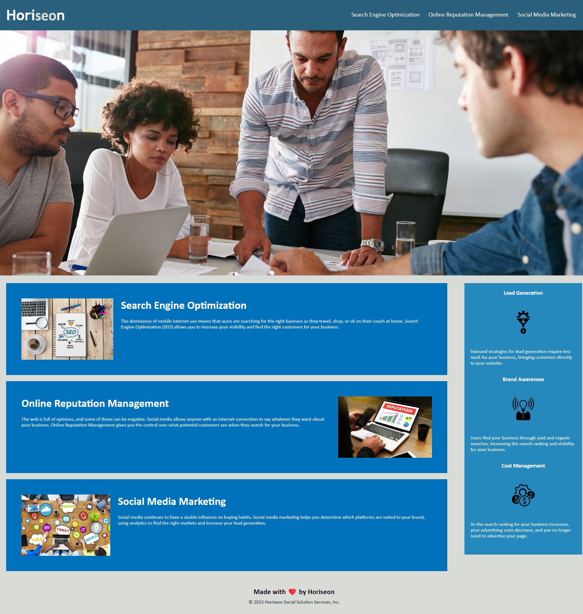

# accessibility-challenge
Bootcamp Challenge 1: Accessibility &amp; SEO Optimization

## Description
As a coding boot camp student, I refactored existing code in order to further my understanding of website accessibility, semantic HTML tags, and CSS functionality and structure. To improve the website's accessibility and SEO optimization, I used semantic HTML tags and image alt text. I also improved the efficiency of the CSS by consolidating selectors and properties, reducing and/or eliminating redundant, repetitive code, and added CSS comments to clearly identify styling elements and function.

## Usage

GitPages URL: 

## Credits
I collaborated with a few fellow boot camp students during this project, exchanging ideas and feedback. These include: Heather Rideaux, Sarah Chambers, Judith Hernandez, Keri Sen, and David Albala.

## License
N/A